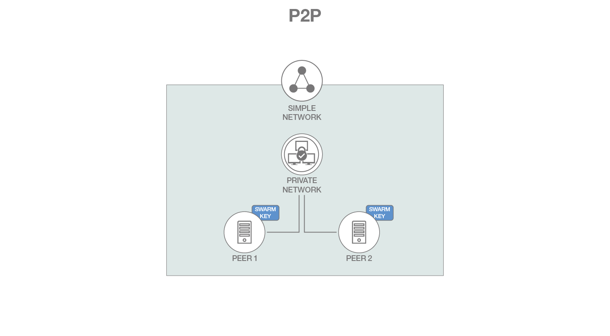
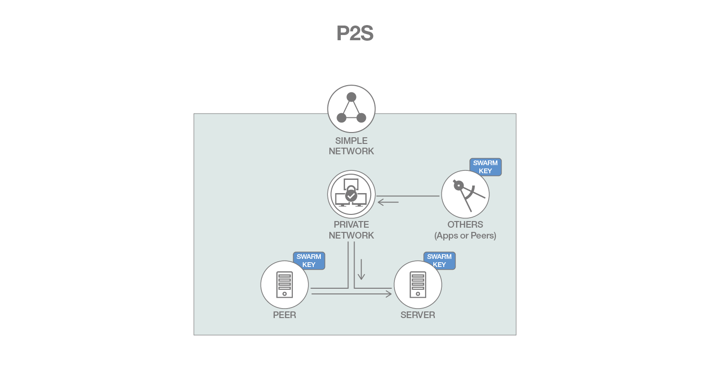
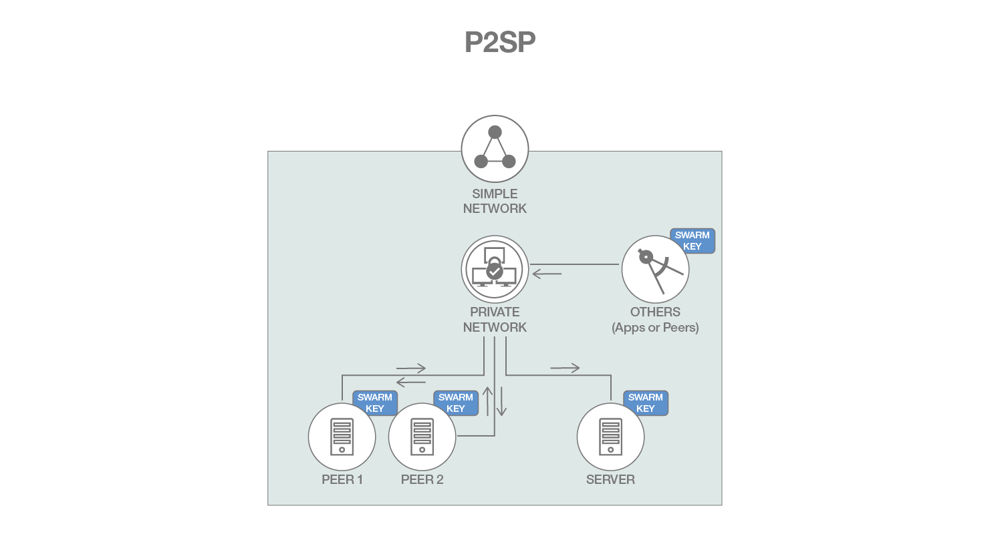

# Architecture References

There are the referenced architecture diagrams of each scenarios (p2p, p2s, and p2sp) of simple network.

## P2P

P2P Network:

Use P2P network to share files between peer to peer privately and securely like on a single BitTorrent swarm's permissioned network.

## P2S

P2S Network:

Use P2S network to construct a scene where server to handle the peer’s request, and peer to send the file request to the sever.

## P2SP

P2SP Network:

Use P2SP network to download files from server, where the server is considered as transit-station, and share resources to other peers via server.